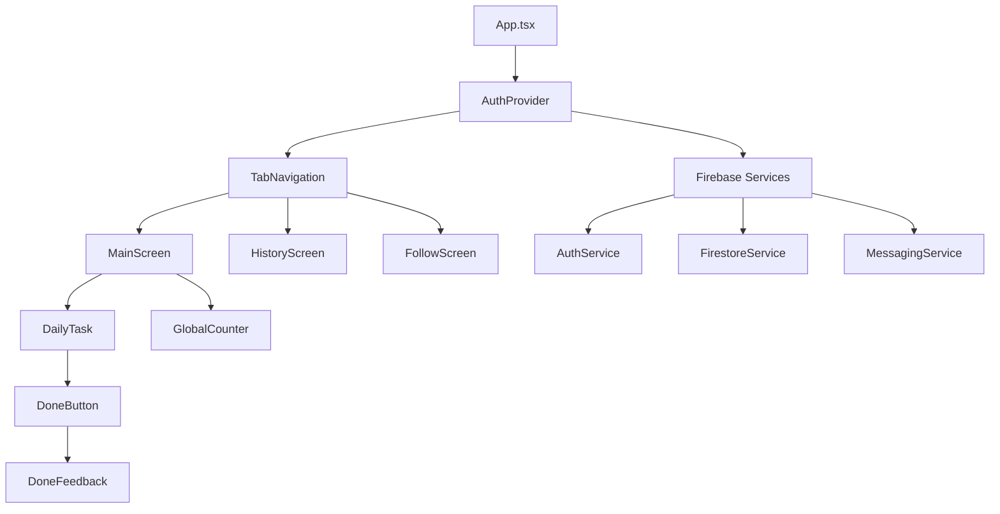
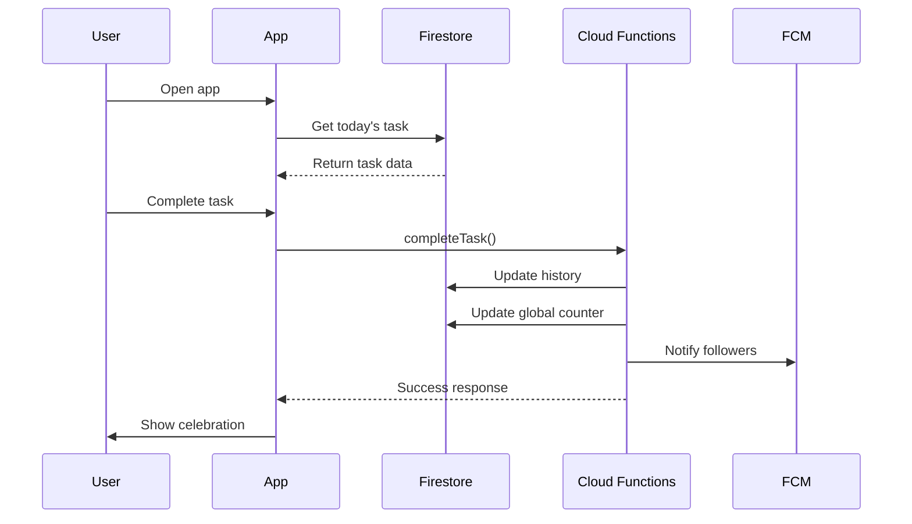
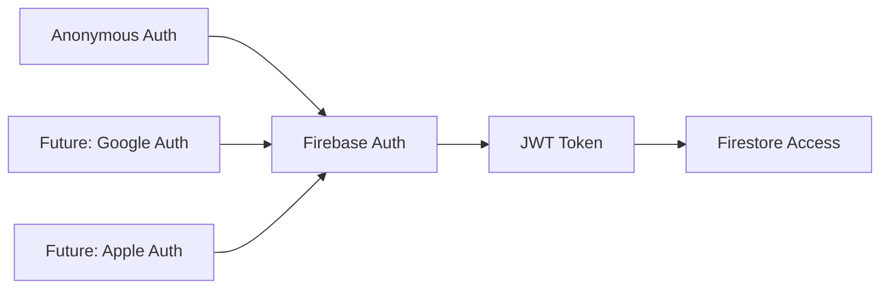

# System Architecture

## 🏗 Overview

Ichizen is built as a modern **React Native mobile application** with a **Firebase backend**, managed through a **Turborepo monorepo** structure. The architecture emphasizes simplicity, performance, and maintainability.

## 📱 Frontend Architecture

### React Native Application

```
apps/mobile/src/
├── components/         # Reusable UI components
│   ├── DailyTask.tsx      # Main task display
│   ├── DoneButton.tsx     # Task completion button
│   ├── DoneFeedback.tsx   # Success animations
│   ├── GlobalCounter.tsx  # World kindness counter
│   └── TabNavigation.tsx  # Bottom tab navigation
├── screens/            # Application screens
│   ├── MainScreen.tsx     # Primary app interface
│   ├── HistoryScreen.tsx  # Personal history calendar
│   ├── FollowScreen.tsx   # Social features
│   └── SignInScreen.tsx   # Authentication
├── services/           # Business logic layer
│   ├── auth.ts           # Authentication service
│   ├── firestore.ts      # Database operations
│   ├── taskService.ts    # Task management
│   ├── counterService.ts # Global counter logic
│   └── messaging.ts      # Push notifications
├── contexts/           # React state management
│   └── AuthContext.tsx   # User authentication state
├── config/             # Environment configuration
│   ├── firebase.ts       # Firebase initialization
│   └── firebase.dev.ts   # Development config
├── i18n/              # Internationalization
│   ├── locales/ja.json   # Japanese translations
│   └── locales/en.json   # English translations
└── types/             # TypeScript definitions
    ├── firebase.ts       # Firebase data models
    └── index.ts          # Application types
```

### Component Architecture



### State Management

- **React Context**: Authentication and user state
- **Local State**: Component-specific UI state
- **Firebase Realtime**: Server state synchronization
- **Async Storage**: Local persistence and caching

## ☁️ Backend Architecture

### Firebase Services

```
Firebase Project: ichizen-daily-good-deeds
├── Authentication      # Anonymous user management
├── Cloud Firestore     # NoSQL document database
├── Cloud Functions     # Serverless TypeScript functions
├── Cloud Messaging     # Push notification service
└── Hosting            # Static asset hosting (future)
```

### Database Schema

```typescript
// Firestore Collections
interface DatabaseSchema {
  users: {
    uid: string;
    createdAt: Timestamp;
    language: "ja" | "en";
    fcmToken?: string;
  };

  tasks: {
    id: string;
    text: {ja: string; en: string};
    category: string;
    difficulty: "easy" | "medium" | "hard";
  };

  daily_task_history: {
    userId: string;
    date: string; // YYYY-MM-DD
    taskId: string;
    completedAt: Timestamp;
  };

  global_counter: {
    date: string; // YYYY-MM-DD
    totalCount: number;
    lastUpdated: Timestamp;
  };

  follows: {
    followerId: string;
    followingId: string;
    createdAt: Timestamp;
  };
}
```

### Cloud Functions

```
apps/functions/src/
├── index.ts                    # Function exports
├── dailyTaskSchedulerHelpers.ts # Task selection logic
└── notifications.ts            # Push notification handlers

Deployed Functions:
├── getTodayTask               # Daily task retrieval
├── completeTask              # Task completion handler
└── dailyTaskScheduler        # Scheduled task management
```

### Data Flow



## 🔧 Monorepo Architecture

### Turborepo Structure

```
ichizen/ (Root)
├── apps/
│   ├── mobile/          # React Native application
│   └── functions/       # Cloud Functions
├── packages/            # Shared packages (future)
├── docs/               # Documentation
├── scripts/            # Development utilities
├── turbo.json         # Turborepo configuration
└── package.json       # Workspace root
```

### Build System

```json
// turbo.json - Key task definitions
{
  "tasks": {
    "build": {
      "dependsOn": ["^build"],
      "outputs": ["dist/**", "lib/**"]
    },
    "test": {
      "dependsOn": ["^build"],
      "outputs": [],
      "inputs": ["src/**/*.{ts,tsx}", "**/__tests__/**"]
    },
    "functions:deploy": {
      "dependsOn": ["functions#build", "functions#test", "functions#lint"],
      "cache": false
    }
  }
}
```

### Performance Optimizations

- **Intelligent Caching**: 96ms execution with full cache
- **Parallel Execution**: Multiple packages build simultaneously
- **Dependency Tracking**: Only rebuild changed packages
- **Incremental Builds**: Leverage previous build artifacts

## 🌐 Network Architecture

### API Communication

```typescript
// Service Layer Pattern
interface TaskService {
  getTodayTask(): Promise<Task>;
  completeTask(taskId: string): Promise<void>;
  getTaskHistory(): Promise<TaskHistory[]>;
}

// Firebase SDK Integration
import firestore from "@react-native-firebase/firestore";
import auth from "@react-native-firebase/auth";
import messaging from "@react-native-firebase/messaging";
```

### Real-time Updates

- **Firestore Listeners**: Real-time data synchronization
- **FCM Messages**: Push notification delivery
- **Offline Support**: Local caching with automatic sync

### Security Model

```javascript
// Firestore Security Rules
rules_version = '2';
service cloud.firestore {
  match /databases/{database}/documents {
    // Users can only access their own data
    match /users/{userId} {
      allow read, write: if request.auth != null && request.auth.uid == userId;
    }

    // Task history is user-specific
    match /daily_task_history/{historyId} {
      allow read, write: if request.auth != null &&
        resource.data.userId == request.auth.uid;
    }

    // Tasks are read-only for all authenticated users
    match /tasks/{taskId} {
      allow read: if request.auth != null;
    }
  }
}
```

## 📊 Performance Architecture

### Mobile Performance

- **React Native Firebase SDK**: Native performance over web SDK
- **Lazy Loading**: Screen-level code splitting
- **Image Optimization**: WebP format with caching
- **Bundle Optimization**: Tree shaking and minification

### Backend Performance

- **Firestore Indexing**: Optimized query performance
- **Function Cold Starts**: Minimum initialization
- **CDN Distribution**: Global asset delivery
- **Connection Pooling**: Efficient database connections

### Caching Strategy

```typescript
// Multi-layer caching
interface CacheStrategy {
  // Level 1: In-memory (React state)
  memory: Map<string, any>;

  // Level 2: Local storage (AsyncStorage)
  localStorage: AsyncStorage;

  // Level 3: Firestore offline (automatic)
  firestoreCache: FirestoreCache;

  // Level 4: CDN (static assets)
  cdn: CloudflareCDN;
}
```

## 🔒 Security Architecture

### Authentication Flow



### Data Protection

- **Firebase Security Rules**: Server-side authorization
- **TypeScript Types**: Compile-time data validation
- **Input Sanitization**: Client-side validation
- **HTTPS Only**: All network communication encrypted

### Privacy Design

- **Anonymous by Default**: No personal data required
- **Minimal Data Collection**: Only necessary app data
- **User Control**: Easy data deletion
- **No Data Mining**: Focus on user experience over analytics

## 🧪 Testing Architecture

### Test Strategy

```
Testing Pyramid:
├── Unit Tests (80%)        # Individual functions
├── Integration Tests (15%) # Component interactions
└── E2E Tests (5%)         # Full user workflows
```

### Test Structure

```typescript
// Mobile Tests: 148 tests across 16 suites
apps/mobile/__tests__/
├── components/         # Component unit tests
├── services/          # Business logic tests
├── screens/           # Screen integration tests
└── utils/            # Utility function tests

// Functions Tests: 11 comprehensive tests
apps/functions/src/__tests__/
├── index.test.ts              # Function integration
├── notifications.test.ts      # Push notification logic
└── dailyTaskScheduler.test.ts # Scheduled tasks
```

### Test Coverage

- **Overall**: 148/151 tests passing (98% success rate)
- **Critical Path**: 100% coverage on core user flows
- **Edge Cases**: Comprehensive error handling tests
- **Performance**: Load testing for concurrent users

## 🚀 Deployment Architecture

### CI/CD Pipeline

```yaml
# GitHub Actions Workflow
name: Deploy
on: [push, pull_request]

jobs:
  test:
    - Install dependencies
    - Run Turborepo tests
    - Run type checking
    - Run linting

  build:
    - Build mobile (iOS/Android)
    - Build Cloud Functions
    - Generate artifacts

  deploy:
    - Deploy functions to Firebase
    - Update Firestore rules
    - Deploy to app stores (future)
```

### Environment Management

```typescript
// Environment Configuration
interface Environment {
  development: {
    firebase: FirebaseEmulator;
    database: LocalFirestore;
    functions: LocalFunctions;
  };

  production: {
    firebase: FirebaseProject;
    database: CloudFirestore;
    functions: CloudFunctions;
  };
}
```

### Scalability Considerations

- **Firestore Scaling**: Automatic horizontal scaling
- **Function Concurrency**: Cloud Functions auto-scaling
- **Mobile Distribution**: App store global distribution
- **CDN Integration**: Static asset optimization

For implementation details, see [`DEVELOPMENT.md`](DEVELOPMENT.md).
For deployment procedures, see [`DEPLOYMENT.md`](DEPLOYMENT.md).
